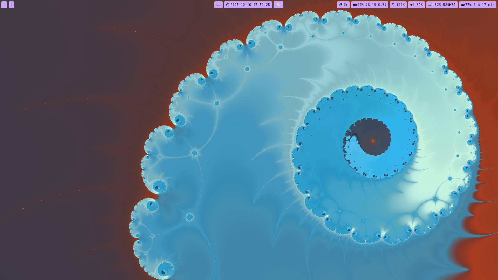
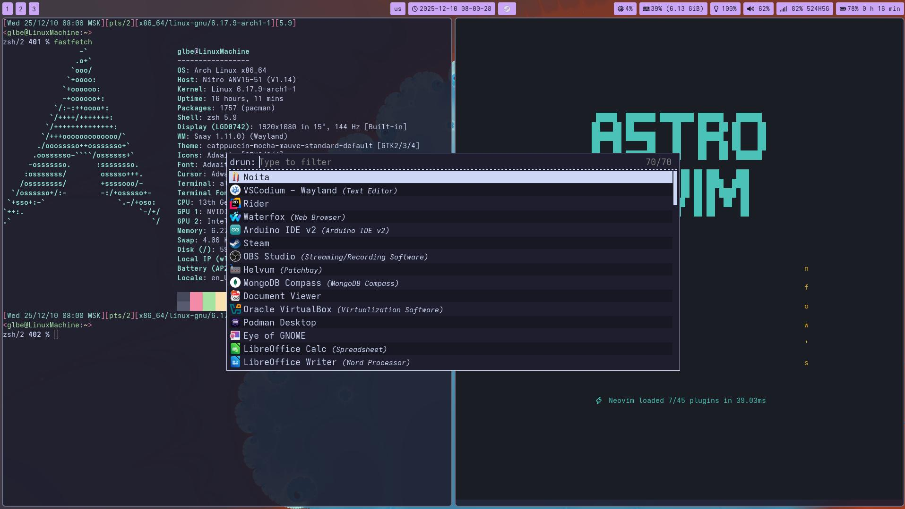
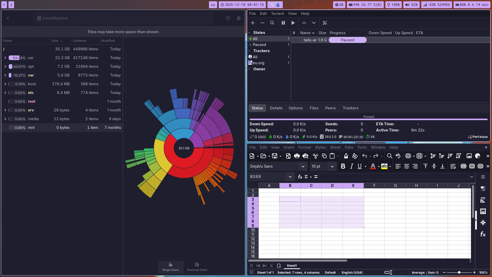

# dotfiles

Style: _Catppuccin Mocha_

Needed software:
- `swayfx` (only used for `corner_radius` in sway config)
- `waybar` 
- `brightnessctl` (scripts in sway config folder)
- `wireplumber` (binds in sway config)
- `mako` (need for brightness and volume changing)
- `rofi` (bind Meta+D in sway config)
- `nautilus` (bind Meta+Ctrl+F in sway config)
- `flameshot` (bind Print in sway config)
- `alacritty` (bind Meta+Enter in sway config)
- `nvim` (pure optional)
- `zsh` 
- `wooz` (bind Insert in sway config)

*NB0*: I am sure that I am missing some software.

*NB1*: check page on Arch Wiki about GTK and QT unified look.
`nwg-look` may help you in this

## Pictures

